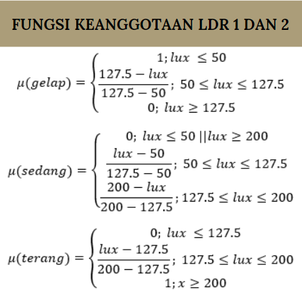
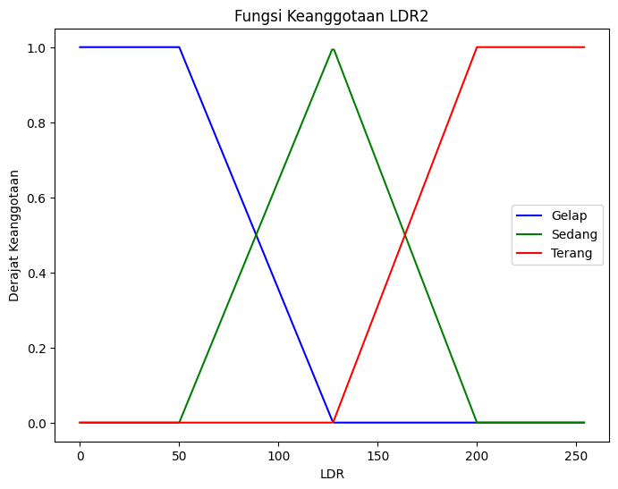
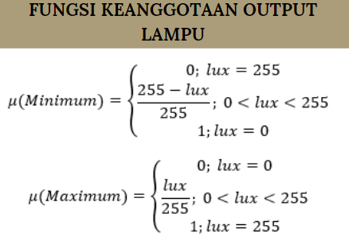
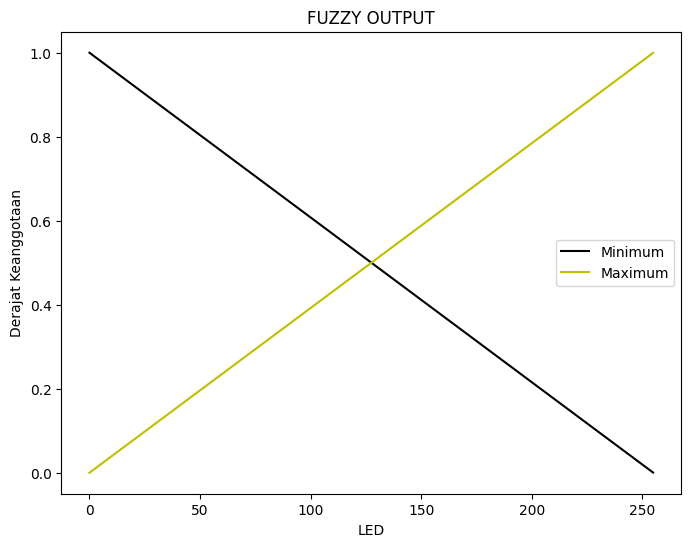
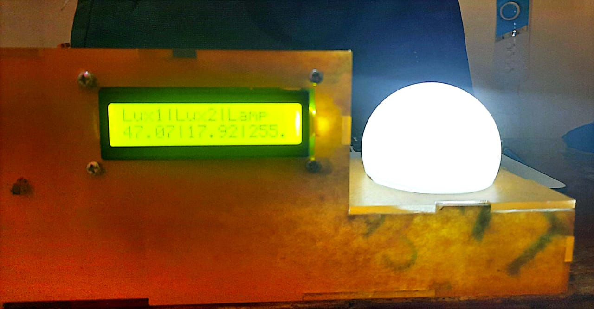

# Automatic-Control-Light-Intensity-using-Fuzzy-Logic

### Project 
- Automatic Light Intensity Control with Fuzzy Logic is an automatic regulation system that uses fuzzy logic (Tsukamoto) principles to control the brightness level or intensity of lights.
- This automation system helps in optimizing energy use by regulating light intensity according to environmental conditions. Efficient use of electricity in lighting can bring economic, environmental and comfort benefits to users.
---
### Membership Function
- Membership Function LDR 1
  
  

- Membership Function LDR 2
  
  

- Membership Function Output LED
  
  

### Rule Based
- if Dark1 and Dark2 then LED Maximum
- if Dark1 and Medium2 then LED Maximum
- if Dark1 and Bright2 then LED Minimum
- if Medium1 and Dark2 then LED Maximum
- if Medium1 and Medium2 then LED Maximum
- if Medium1 and Bright2 then LED Minimum
- if Bright1 and Dark2 then LED Minimum
- if Bright1 and Medium2 then LED Minimum
- if Bright1 and Bright2 then LED Minimum

### Hardware Use
- Arduino Uno
- LDR Sensor
- LED
- LCD
- Resistor 10k
- Jumper Cables
- Breadboard
- Acrylic

### Result

